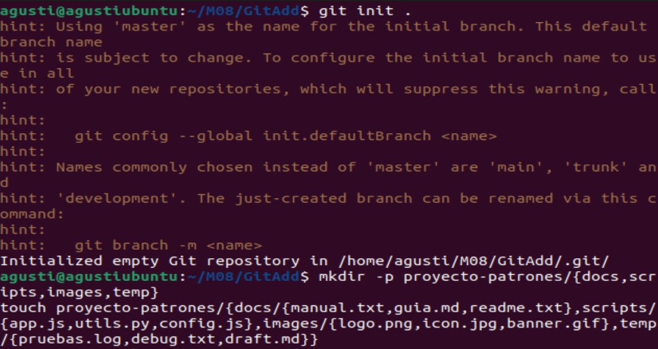
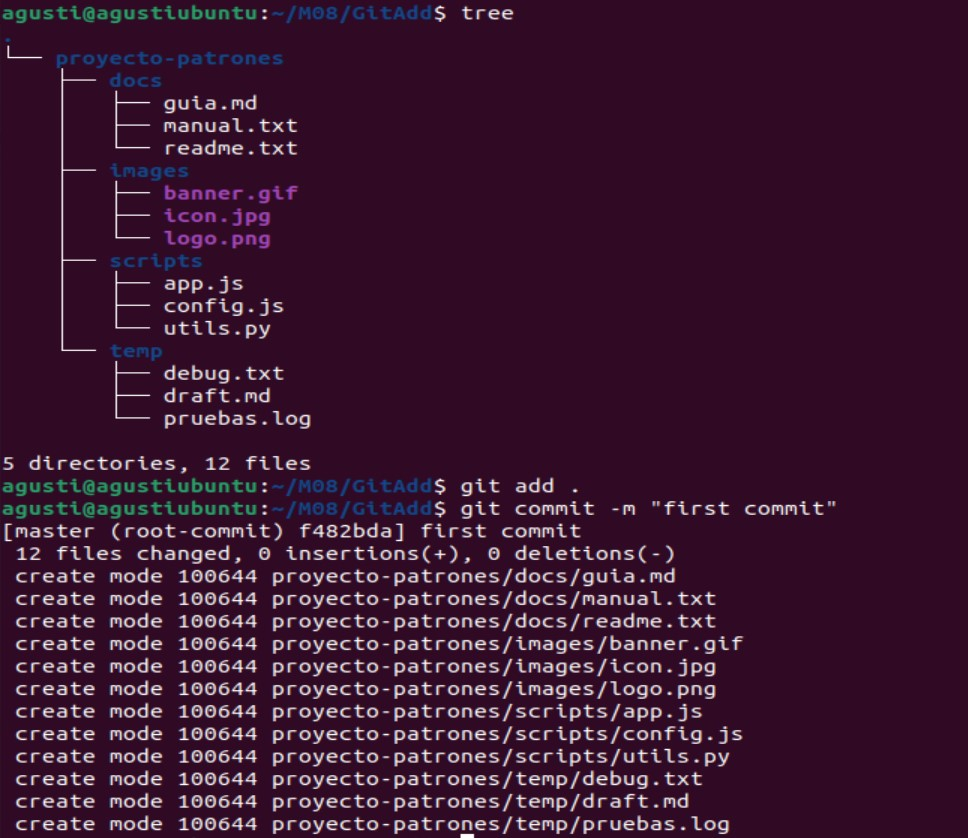
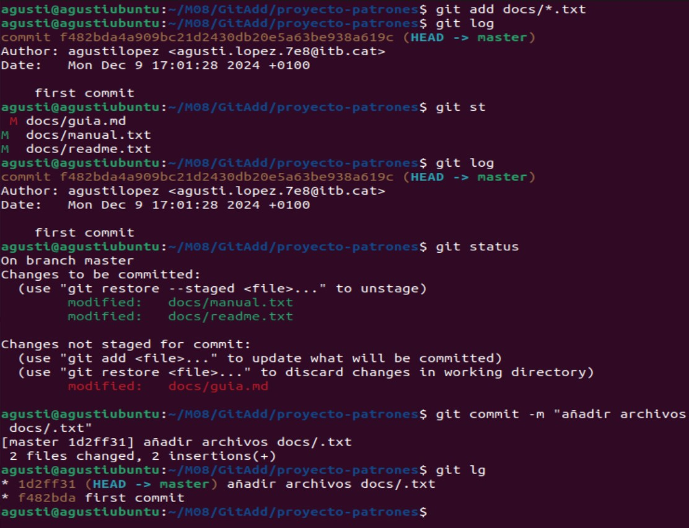
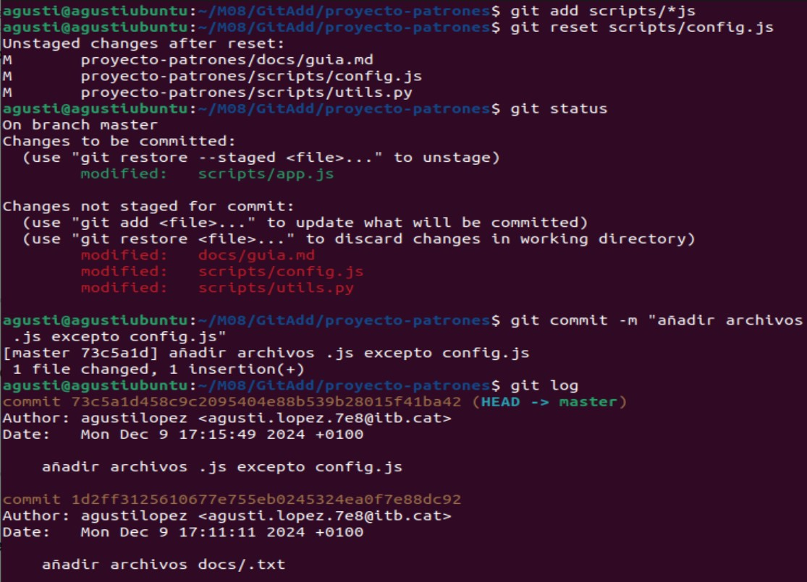
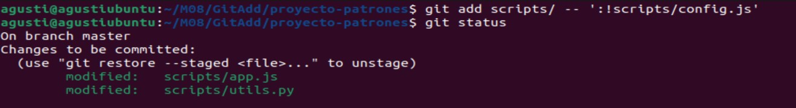
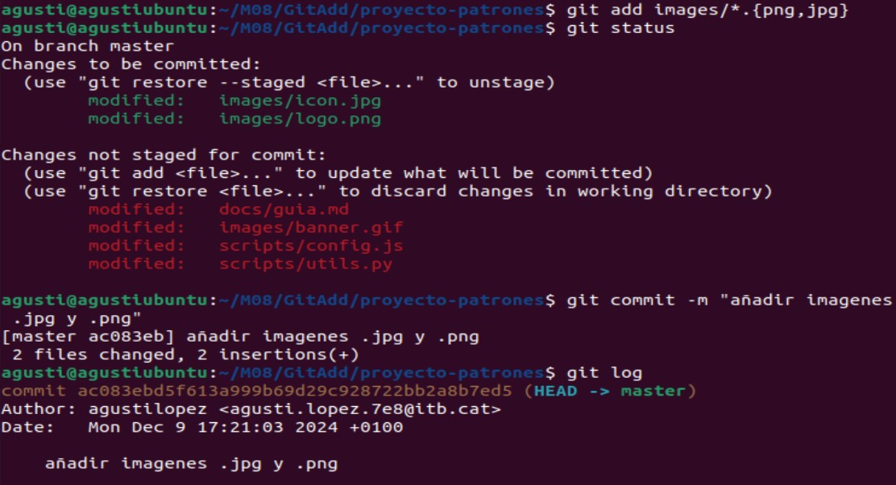
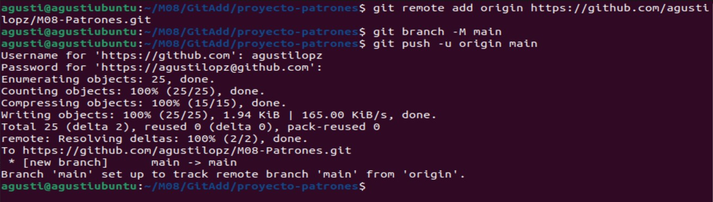

# Práctica Extra (Git Add y Patrones) - Agustí López

*Este es un proyecto de ámbito académico para practicar Git Add y patrones.*

## Esctructura inicial del proyecto
**1. Crea la estructura de archivos y directorios**
```bash
mmkdir -p proyecto-patrones/{docs,scripts,images,temp}
touch proyecto-patrones/{docs/{manual.txt,guia.md,readme.txt},scripts/{app.js,utils.py,config.js},images/{logo.png,icon.jpg,banner.gif},temp/{pruebas.log,debug.txt,draft.md}}
```


**2. Verifica la estructura**
```bash
tree
```

**3. Inicializa el repositorio y haz un commit inicial.**
```bash
git add .
git commit -m "first commit"

```


## Comenzamos
### 1. Preparar archivos con patrones simples
**1.Añade solo los archivos .txt que están en la carpeta docs/ y muestra el estado.**
**2. Haz un commit.**


### 2. Trabaja con subdirectorios y extensiones
**1. Añade todos los archivos .js del directorio scripts/ pero excluye config.js y muestra el estado.**
```bash
git add docs/*.txt
git status
```
**2. Haz un commit con los cambios.**
Opción 1:

```bash
git add scripts/*.js
git reset scripts/config.js
```
Opción 2:
```bash
git add scripts/ -- ':!scripts/config.js'
```


### 3. Máscaras en niveles
**1. Añade todas las imágenes excepto las que terminan en .gif**
```bash
git add images/*.{png,jpg}
```
**2. Confirma que los archivos .png y .jpg están en el área de preparación y muestra el estado.**
**3. Haz un commit.**
```bash
git status
```


### 4. Sube el repositorio Git Local al Remoto

```bash
git remote add origin https://github.com/agustilopz/M08-Patrones.git
git branch -M main
git push -u origin main
```

